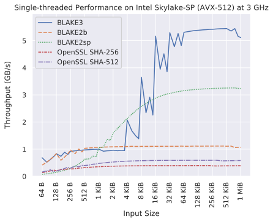

# <a href="#"></a>

BLAKE3 is a cryptographic hash function that is:

- **Much faster** than MD5, SHA-1, SHA-2, SHA-3, and BLAKE2.
- **Secure**, unlike MD5 and SHA-1. And secure against length extension,
  unlike SHA-2.
- **Highly parallelizable** across any number of threads and SIMD lanes,
  because it's a Merkle tree on the inside.
- Capable of **verified streaming** and **incremental updates**, again
  because it's a Merkle tree.
- A **PRF**, **MAC**, **KDF**, and **XOF**, as well as a regular hash.
- **One algorithm with no variants**, which is fast on x86-64 and also
  on smaller architectures.

The chart below shows BLAKE3's performance on modern server hardware, an
Intel Cascade Lake-SP 8275CL processor:

<p align="center">

</p>

BLAKE3 is based on an optimized instance of the established hash
function [BLAKE2](https://blake2.net) and on the [original Bao tree
mode](https://github.com/oconnor663/bao/blob/master/docs/spec_0.9.1.md).
The specifications and design rationale are available in the [BLAKE3
paper](https://github.com/BLAKE3-team/BLAKE3-specs/blob/master/blake3.pdf).
The default output size is 256 bits. The current version of
[Bao](https://github.com/oconnor663/bao) implements verified streaming
with BLAKE3.

This repository provides the official Rust implementation of BLAKE3,
with

* The [`blake3`](https://crates.io/crates/blake3) Rust crate, which
  includes optimized SIMD implementations, using dynamic CPU feature
  detection on x86. SSE4.1 and AVX2 support are implemented in Rust,
  while AVX-512 and ARM NEON support are implemented in C and controlled
  by the `c_avx512` and `c_neon` features. Multi-threading is
  implemented with [Rayon](https://github.com/rayon-rs/rayon) and
  controlled by the `rayon` feature. 

* A simplified [reference
  implementation](reference_impl/reference_impl.rs), which is portable
  and `no_std`-compatible.

* The [`b3sum` sub-crate](./b3sum), which provides a command line
  interface. You can install it with `cargo install b3sum`. It includes
  multi-threading and AVX-512 support by default.

* [](https://github.com/BLAKE3-team/BLAKE3/actions)

BLAKE3 was designed by:

* [@oconnor663 ](https://github.com/oconnor663) (Jack O'Connor)
* [@sneves](https://github.com/sneves) (Samuel Neves)
* [@veorq](https://github.com/veorq) (Jean-Philippe Aumasson)
* [@zookozcash](https://github.com/zookozcash) (Zooko)

The development of BLAKE3 was sponsored by
[Teserakt](https://teserakt.io) and [Electric Coin Company](https://electriccoin.co).

*NOTE: BLAKE3 is not a password hashing algorithm, because it's
designed to be fast, whereas password hashing should not be fast. If you
hash passwords to store the hashes or if you derive keys from passwords,
we recommend [Argon2](https://github.com/P-H-C/phc-winner-argon2).*

## Usage

This repository provides the `b3sum` command line utility and the
`blake3` Rust crate.

### The `b3sum` utility

The `b3sum` utility allows you to process files and data from standard
input using BLAKE3 in any of its three modes.
To use `b3sum` on the command line, [install Rust and
Cargo](https://doc.rust-lang.org/cargo/getting-started/installation.html),
and then run:

```bash
cargo install b3sum
```

If `rustup` didn't configure your `PATH` for you, you might need to go
looking for the installed binary in e.g. `~/.cargo/bin`. You can test
out how fast BLAKE3 is on your machine by creating a big file and
hashing it, for example as follows:

```bash
# Create a 1 GB file.
head -c 1000000000 /dev/zero > /tmp/bigfile
# Hash it with SHA-256.
time openssl sha256 /tmp/bigfile
# Hash it with BLAKE3.
time b3sum /tmp/bigfile
```

### The `blake3` crate

To use BLAKE3 from Rust code, add a dependency on the `blake3` crate to
your `Cargo.toml`. Here's an example of hashing some input bytes:

```rust
// Hash an input all at once.
let hash1 = blake3::hash(b"foobarbaz");

// Hash an input incrementally.
let mut hasher = blake3::Hasher::new();
hasher.update(b"foo");
hasher.update(b"bar");
hasher.update(b"baz");
let hash2 = hasher.finalize();
assert_eq!(hash1, hash2);

// Extended output. OutputReader also implements Read and Seek.
let mut output = [0; 1000];
let mut output_reader = hasher.finalize_xof();
output_reader.fill(&mut output);
assert_eq!(&output[..32], hash1.as_bytes());
```

Besides `hash`, BLAKE3 provides two other modes, `keyed_hash` and
`derive_key`. The `keyed_hash` mode takes a 256-bit key:

```rust
// MAC an input all at once.
let example_key = [42u8; 32];
let mac1 = blake3::keyed_hash(&example_key, b"example input");

// MAC incrementally.
let mut hasher = blake3::Hasher::new_keyed(&example_key);
hasher.update(b"example input");
let mac2 = hasher.finalize();
assert_eq!(mac1, mac2);
```

The `derive_key` mode takes a context string of any length and key
material of any length, and it outputs a derived key of any length. The
context string should be hardcoded, globally unique, and
application-specific. A good default format for the context string is
`"[application] [commit timestamp] [purpose]"`:

```rust
// Derive a couple of subkeys for different purposes.
const EMAIL_CONTEXT: &str = "BLAKE3 example 2020-01-07 17:10:44 email key";
const API_CONTEXT: &str = "BLAKE3 example 2020-01-07 17:11:21 API key";
let input_key = b"some very secret key material (>'-')> <('-'<) ^('-')^";
let mut email_key = [0; 32];
blake3::derive_key(EMAIL_CONTEXT, input_key, &mut email_key);
let mut api_key = [0; 32];
blake3::derive_key(API_CONTEXT, input_key, &mut api_key);
assert!(email_key != api_key);
```

## Contributing

Please see [CONTRIBUTING.md](CONTRIBUTING.md).

## Intellectual property

The Rust code is copyright Jack O'Connor, 2019-2020. 
The C code is copyright Samuel Neves and Jack O'Connor, 2019-2020.

This work is released into the public domain with CC0 1.0.
Alternatively, it is licensed under the Apache License 2.0.
