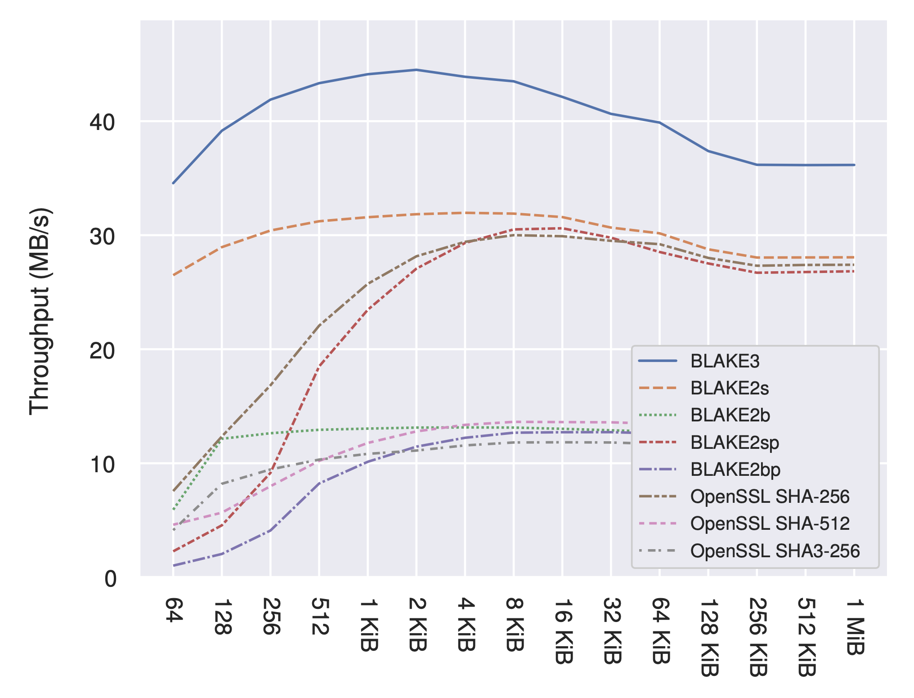

# BLAKE3

BLAKE3 is a cryptographic hash function that is

1. Faster than MD5, SHA1, SHA2, SHA3, and even BLAKE2
1. Highly parallelizable: The more data and the more cores, the faster it
goes. (For you specialists reading this: this is because it is actually a
MerkleTree under the hood.)
1. Capable of streaming and random-access verification. (Again: the magic of Merkle Trees.)
1. Carefully engineered to be simple and safe to use, with no "modes" or tweaks required.

This repository provides the reference implementation of BLAKE3, which
is coded in Rust and includes portable as well as optimized code for
various instructions sets.

The complete specifications and design rationale are available as a
[PDF](https://github.com/BLAKE3-team/BLAKE3-specs/raw/master/blake3.pdf) and its
[LaTeX source](https://github.com/BLAKE3-team/BLAKE3-specs/).

The following graph shows BLAKE3's multi-threaded throughput on an Intel
Kany Lake processor:

BLAKE3 was designed by:

* [@oconnor63 ](https://github.com/oconnor63) (Jack O'Connor)
* [@sneves](https://github.com/sneves) (Samuel Neves)
* [@veorq](https://github.com/veorq) (Jean-Philippe Aumasson)
* [@zookozcash](https://github.com/zookozcash) (Zooko)

*WARNING*: BLAKE3 is not a password-hash function, because it's designed
to be fast, whereas password hashing should not be fast.
If you hash passwords to store the hashes or if you derive keys from password, we recommend
[Argon2](https://github.com/P-H-C/phc-winner-argon2).

## Usage

TODO

## History

TODO: BLAKE, BLAKE3, Bao

## Contributing

Please see [CONTRIBUTING.md](CONTRIBUTING.md)

## Licensing

The source code in the present repository is dual-licensed under Apache
2 and 

TODO: Apache 2 and CC0

